# Auth State Machine Diagram

This diagram models the current auth-related components that already exist in the app.

Covered components:

| Layer | Components |
| --- | --- |
| Frontend shell | `frontend/src/App.js`, `frontend/src/components/Header/index.js` |
| Frontend auth UI | `frontend/src/pages/Register/index.js`, `frontend/src/pages/Login/index.js`, `frontend/src/pages/Profile/index.js` |
| Frontend services | `frontend/src/services/authService.js`, `frontend/src/services/api.js` |
| Backend routes/middleware | `backend/src/routes/authRoutes/index.js`, `backend/src/middleware/validationMiddleware/index.js`, `backend/src/middleware/authMiddleware/index.js` |
| Backend auth/data | `backend/src/controllers/authController/index.js`, `backend/src/models/userModel/index.js`, `users` table |

## State Machine

```mermaid
stateDiagram-v2
    [*] --> AppBoot

    AppBoot: App.js reads localStorage
    AppBoot --> Anonymous: missing token or user / authService.logout()
    AppBoot --> Authenticated: token and user found / setUser(savedUser)

    Anonymous: No active frontend session
    Anonymous --> RegisterForm: open /register
    Anonymous --> LoginForm: open /login

    RegisterForm: Register.js editing fields
    RegisterForm --> RegisterBlocked: password invalid or confirmation mismatch
    RegisterBlocked --> RegisterForm: user fixes fields
    RegisterForm --> RegisterSubmitting: valid form submitted
    RegisterSubmitting --> RegisterRejected: validateRegister or controller error
    RegisterRejected --> RegisterForm: show error and retry
    RegisterSubmitting --> UserCreated: authController.register creates user
    UserCreated --> Anonymous: frontend logs out and redirects to /login

    LoginForm: Login.js editing credentials
    LoginForm --> LoginSubmitting: submit email and password
    LoginSubmitting --> LoginRejected: validateLogin, user lookup, inactive user, or bad password
    LoginRejected --> LoginForm: show error and retry
    LoginSubmitting --> PasswordMigrating: legacy plaintext password detected
    PasswordMigrating --> LoginRejected: password migration error
    PasswordMigrating --> SessionSaved: password re-hashed successfully
    LoginSubmitting --> SessionSaved: bcrypt password valid

    SessionSaved: token + user saved in localStorage
    SessionSaved --> Authenticated: onLogin(user) updates App state

    Authenticated: Active frontend session
    Authenticated --> CustomerRoutes: user.role == customer
    Authenticated --> AdminRoutes: user.role == admin
    Authenticated --> StaffRoutes: user.role == staff

    CustomerRoutes: customer pages are available
    AdminRoutes: admin pages are available
    StaffRoutes: staff pages are available

    CustomerRoutes --> ProfileEditing: open /profile
    ProfileEditing --> ProtectedApiRequest: submit profile update
    CustomerRoutes --> ProtectedApiRequest: call protected customer API
    AdminRoutes --> ProtectedApiRequest: call protected admin API
    StaffRoutes --> ProtectedApiRequest: call protected staff API

    ProtectedApiRequest: api.js adds Authorization Bearer token
    ProtectedApiRequest --> TokenRejected: missing, malformed, expired, or invalid token
    ProtectedApiRequest --> TokenAccepted: authMiddleware.verifyToken succeeds
    TokenAccepted --> ProfileUpdated: authController.updateProfile succeeds
    ProfileUpdated --> CustomerRoutes: setUser(updatedUser) and authService.setUser()
    TokenAccepted --> ProtectedActionComplete: protected action succeeds
    ProtectedActionComplete --> Authenticated: stay signed in
    TokenRejected --> Authenticated: backend returns 401; frontend stays until user action

    CustomerRoutes --> LogoutConfirm: Header logout clicked
    AdminRoutes --> LogoutConfirm: Header logout clicked
    StaffRoutes --> LogoutConfirm: Header logout clicked
    LogoutConfirm --> Authenticated: cancel logout
    LogoutConfirm --> Anonymous: confirm / setUser(null), authService.logout(), navigate("/")

    Authenticated --> [*]
    Anonymous --> [*]
```

## Important Current Behaviors

| Behavior | Current implementation |
| --- | --- |
| App startup | `App.js` restores the session only when both `token` and `user` exist in `localStorage`. |
| Register success | Backend returns a `user`, but `Register.js` calls `authService.logout()` and redirects to `/login`; it does not auto-login. |
| Login success | `Login.js` saves `token` and `user`, calls `onLogin(user)`, then routes by `user.role`. |
| Protected calls | `api.js` injects `Authorization: Bearer {token}`; backend `verifyToken` rejects missing/malformed/expired/invalid tokens. |
| Logout | `Header.js` asks for confirmation, then clears App state and localStorage before navigating home. |
