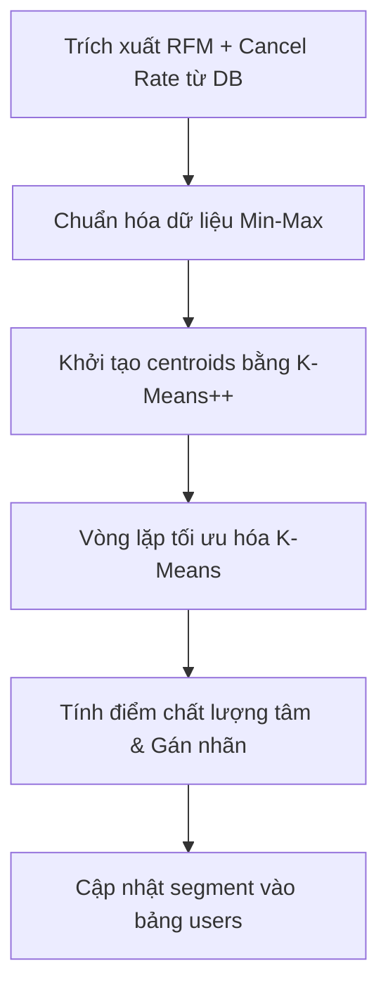

# Kiến thức Học máy & Thuật toán Phân tích trong BeautyBook

Tài liệu này trình bày chi tiết về nền tảng lý thuyết học máy không giám sát (Unsupervised Machine Learning) và các thuật toán phân tích thông minh được thiết kế, cài đặt trực tiếp trong mã nguồn của hệ thống **BeautyBook**.

---

## 1. Thuật toán Phân cụm Khách hàng K-Means

Dự án cài đặt thuật toán phân cụm **K-Means thuần bằng Javascript** để phân khúc khách hàng tự động dựa trên các chỉ số hành vi. Việc tự triển khai giúp hệ thống chạy trực tiếp trên môi trường Node.js mà không cần phụ thuộc vào các thư viện Python bên ngoài.

**Vị trí mã nguồn**: [clusteringService/index.js](file:///d:/Doantotnghiep/Code/backend/src/services/clusteringService/index.js)

### Quy trình phân cụm 5 bước trong hệ thống:

### 1.1. Trích xuất đặc trưng (Feature Extraction)
Hệ thống trích xuất 4 thuộc tính hành vi cốt lõi từ bảng `appointments` của từng khách hàng:
- **Recency ($R$)**: Số ngày kể từ lần hẹn gần nhất của khách hàng tới thời điểm hiện tại.
- **Frequency ($F$)**: Tổng tần suất đặt lịch hẹn (giao dịch) phát sinh của khách.
- **Monetary ($M$)**: Tổng số tiền đã thanh toán cho các lịch hẹn hoàn thành.
- **Cancel Rate ($C$)**: Tỷ lệ hủy lịch hẹn hoặc không đến, tính bằng công thức:
  $$C = \frac{\text{Số lịch hủy} + \text{Số lịch không đến (No-Show)}}{\text{Tổng số lịch đặt}} \times 100$$

### 1.2. Chuẩn hóa đặc trưng (Min-Max Normalization)
Do các thuộc tính có đơn vị đo lường và khoảng giá trị khác nhau (ví dụ: $Monetary$ có giá trị hàng triệu đồng trong khi $Frequency$ chỉ từ $1$ đến $10$), hệ thống sử dụng phương pháp **Min-Max Normalization** để đưa tất cả các biến đặc trưng về khoảng $[0, 1]$, tránh việc thuộc tính có giá trị lớn lấn át các thuộc tính khác:
$$x_{\text{norm}} = \frac{x - x_{\text{min}}}{x_{\text{max}} - x_{\text{min}}}$$
*Cài đặt tại hàm `normalizeFeatures`*.

### 1.3. Khởi tạo tâm cụm thông minh bằng K-Means++
Để giải quyết nhược điểm lớn của K-Means truyền thống (dễ rơi vào cực trị cục bộ do chọn tâm cụm ngẫu nhiên), hệ thống triển khai phương pháp khởi tạo **K-Means++** tại hàm `initCentroidsKMeansPlusPlus`:
1. Chọn ngẫu nhiên tâm cụm đầu tiên ($c_1$) từ tập dữ liệu.
2. Với mỗi điểm dữ liệu $x$, tính khoảng cách ngắn nhất từ nó đến tâm cụm gần nhất đã được chọn: $D(x)$.
3. Chọn điểm dữ liệu tiếp theo làm tâm cụm mới với xác suất tỷ lệ thuận với bình phương khoảng cách: $P(x) = \frac{D(x)^2}{\sum D(y)^2}$.
4. Lặp lại bước 2 và 3 cho đến khi đủ $K$ tâm cụm.

### 1.4. Vòng lặp tối ưu hóa K-Means
- **Bước gán cụm (Assignment)**: Tính khoảng cách Euclidean giữa điểm dữ liệu đã chuẩn hóa $x$ và các tâm cụm (centroid) $c_j$:
  $$d(x, c_j) = \sqrt{\sum_{i=1}^{D} (x_{\text{norm}, i} - c_{j, i})^2}$$
  Điểm dữ liệu được gán vào cụm có khoảng cách ngắn nhất: $Cluster(x) = \arg\min_j d(x, c_j)$.
- **Bước cập nhật tâm cụm (Update)**: Định vị lại tâm cụm bằng cách lấy trung bình cộng tọa độ các điểm thuộc cụm đó.
- **Điều kiện dừng**: Thuật toán hội tụ khi các chỉ định cụm không còn thay đổi qua các vòng lặp hoặc khi đạt giới hạn `maxIterations = 100`.

### 1.5. Xếp hạng và Gán nhãn tự động cho cụm (Cluster Labeling)
Để biến các mã cụm thuần túy ($C_0, C_1...$) thành thông tin nghiệp vụ có nghĩa, hệ thống tính **Điểm chất lượng tâm cụm (Quality Score)** cho mỗi centroid:
$$Score = (1 - R_{\text{norm}}) \times 0.25 + F_{\text{norm}} \times 0.30 + M_{\text{norm}} \times 0.30 + (1 - C_{\text{norm}}) \times 0.15$$
Các cụm được sắp xếp giảm dần theo điểm số này và gán nhãn lần lượt:
1. **Champions (Khách VIP)**: Điểm chất lượng cao nhất.
2. **Loyal Customers (Khách trung thành)**: Đặt hẹn đều đặn, chi tiêu ổn định.
3. **Potential Loyalists (Khách tiềm năng)**: Có xu hướng tương tác tốt.
4. **Need Attention (Cần chú ý)**: Tần suất giảm, bắt đầu thưa lịch.
5. **At Risk (Nguy cơ rời bỏ)**: Không hoạt động lâu ngày, tỷ lệ hủy cao.

Kết quả phân khúc được ghi nhận trực tiếp vào trường `customer_segment` và `rfm_score` trong bảng `users` nhằm phục vụ việc phân phối Voucher tự động.

---

## 2. Mô hình Chống "Boom" Lịch (Cancellation Score Service)

Để bảo vệ các cửa hàng và nhân viên khỏi thiệt hại do khách hàng đặt hẹn ảo hoặc hủy lịch sát giờ, hệ thống xây dựng mô hình tính điểm rủi ro **Cancellation Score** dựa trên phương pháp kết hợp đa biến có trọng số (Weighted Scoring Model).

**Vị trí mã nguồn**: [cancellationScoreService/index.js](file:///d:/Doantotnghiep/Code/backend/src/services/cancellationScoreService/index.js)

### Cơ cấu tính điểm rủi ro và trọng số:

| Biến Đặc Trưng | Cơ Chế Tính Điểm | Trọng Số | Ý Nghĩa Thực Tế |
| :--- | :--- | :--- | :--- |
| **Lịch sử hủy hẹn (Cancellation Rate)** | Tỷ lệ lịch hủy trong tổng số lịch hẹn đã đặt của khách hàng ($0 - 100\%$). | **40%** | Phản ánh thói quen hủy hẹn của khách hàng trong quá khứ. |
| **Thời gian chuẩn bị (Lead Time)** | Thời gian từ lúc tạo lịch đến thời điểm hẹn thực tế. - $<2$h: 90 điểm rủi ro. - $<6$h: 60 điểm rủi ro. - $<12$h: 40 điểm rủi ro. - $<24$h: 20 điểm rủi ro. - $\ge 24$h: 10 điểm rủi ro. | **20%** | Đặt lịch quá sát giờ phục vụ làm tăng tỷ lệ rủi ro không đến hoặc hủy đột ngột. |
| **Phân cụm khách hàng (K-Means Segment)** | Liên kết trực tiếp kết quả phân cụm từ K-Means: - `Lost Customers`: 80 điểm. - `At Risk`: 65 điểm. - `New Customers`/`New`: 50 điểm. - `Need Attention`: 40 điểm. - `Potential Loyalists`: 20 điểm. - `Loyal Customers`: 10 điểm. - `Champions`: 5 điểm. | **20%** | Áp dụng tri thức học máy từ phân cụm K-Means vào đánh giá rủi ro trực tiếp. |
| **Ngày trong tuần (Day of Week)** | Đánh giá theo ngày của lịch hẹn: - Thứ hai (đầu tuần nhiều biến động): 45 điểm. - Các ngày thường (Thứ ba - Thứ sáu): 30 điểm. - Cuối tuần (Thứ bảy, CN ổn định): 15 điểm. | **10%** | Xu hướng rủi ro hủy hẹn thay đổi theo tâm lý ngày làm việc/ngày nghỉ. |
| **Lịch sử bỏ hẹn (No-Show)** | Dựa trên hành vi bỏ hẹn không thông báo: - $\ge 3$ lần: 90 điểm. - $2$ lần: 60 điểm. - $1$ lần: 30 điểm. - $0$ lần: 0 điểm. | **10%** | Lịch sử bỏ hẹn không báo trước là dấu hiệu cảnh báo cao nhất về độ uy tín. |

### Quy tắc xử lý nghiệp vụ thông minh:
Khi khách hàng đặt hẹn mới, hệ thống tự động tính toán tổng điểm rủi ro hủy lịch ($Score$ từ 0 đến 100):
- **Nếu $Score \le 70$**: Cho phép đặt hẹn trực tiếp, chấp nhận mọi phương thức thanh toán bao gồm thanh toán tại quầy (tiền mặt).
- **Nếu $Score > 70$**:
  - Kích hoạt chế độ **Bắt buộc đặt cọc (Deposit Required)**.
  - Vô hiệu hóa thanh toán bằng tiền mặt, yêu cầu thanh toán trực tuyến qua thẻ hoặc Ví điện tử.
  - **Tỷ lệ đặt cọc**:
    - Nếu $70 < Score \le 85$: Yêu cầu cọc **20%** giá trị đơn dịch vụ.
    - Nếu $Score > 85$: Yêu cầu cọc **30%** giá trị đơn dịch vụ.

---

## 3. Phân cụm Hành vi Động DEC (Dynamic Engagement Clustering)

Bên cạnh mô hình K-Means chu kỳ dài, hệ thống triển khai dịch vụ **Phân cụm hành vi động DEC** để phân nhóm khách hàng tức thời theo các chu kỳ thời gian tùy chỉnh (Ngày, Tuần, Tháng, Năm) dựa trên phân vị động.

**Vị trí mã nguồn**: [decClusteringService/index.js](file:///d:/Doantotnghiep/Code/backend/src/services/decClusteringService/index.js)

### Cơ chế phân vị động (Quantile Thresholds):
Để xác định các mức giá trị dịch vụ của khách hàng là cao cấp hay bình dân mà không sử dụng các con số cứng (Hard-coded), thuật toán sử dụng hàm phân vị (`quantile`) để quét dữ liệu thực tế tại các điểm mốc:
- **Premium Threshold**: Phân vị 75% (`quantile(0.75)`) của giá dịch vụ hoặc tổng chi tiêu, đại diện cho nhóm giá trị cao.
- **Budget Threshold**: Phân vị 40% (`quantile(0.4)`) đại diện cho nhóm bình dân.

### 7 Nhóm hành vi động và quy tắc phân loại:
1. **Frequent Cancel/No-Show (`frequent_cancel_no_show`)**: Số lịch rủi ro (hủy hoặc bỏ hẹn) $\ge 2$ và tỷ lệ hủy lịch $\ge 35\%$.
2. **Many Bookings Low Arrival (`many_bookings_low_arrival`)**: Tổng số lịch đặt $\ge 4$ nhưng tỷ lệ hoàn thành $\le 45\%$.
3. **One Time Then Left (`one_time_then_left`)**: Khách hàng chỉ đặt đúng 1 lần và lần hẹn gần nhất đã trôi qua $\ge 21$ ngày.
4. **Low Usage Premium (`low_usage_premium`)**: Số lịch hoàn thành tối đa là 2 lần nhưng giá trị đơn hàng trung bình thuộc nhóm Premium ($\ge$ Premium Threshold).
5. **High Usage Budget (`high_usage_budget`)**: Tần suất đặt hẹn cao ($\ge 3$ lần hoàn thành) nhưng chi tiêu trung bình thuộc nhóm bình dân ($\le$ Budget Threshold).
6. **Frequent Single Service (`frequent_single_service`)**: Khách quay lại nhiều lần ($\ge 3$ lần đặt lịch) nhưng trung thành với duy nhất 1 dịch vụ nhất định.
7. **Low Monthly Usage (`low_monthly_usage`)**: Khách hàng có lịch đặt trải dài qua nhiều tháng ($\ge 2$ tháng) nhưng tần suất trung bình cực thấp ($\le 1.25$ lịch/tháng).

### Công cụ tạo chiến lược động (Dynamic Strategy Builder):
Hàm `buildDynamicStrategy` tự động ánh xạ cấu hình nhóm khách hàng với chu kỳ thời gian truy vấn để sinh ra các chiến dịch chăm sóc khách hàng tức thời gửi đến quản trị viên, giúp quyết định khuyến mãi linh hoạt theo diễn biến vận hành thực tế.

---

## 4. Chương 4 - Kết quả nghiên cứu

### 4.1. Mục tiêu đánh giá kết quả

Chương này trình bày kết quả đạt được sau quá trình nghiên cứu, thiết kế và xây dựng hệ thống **BeautyBook - Smart Booking Salon**. Mục tiêu chính là chứng minh sản phẩm không chỉ dừng lại ở một website đặt lịch cơ bản, mà có khả năng hỗ trợ vận hành thực tế cho các cơ sở làm đẹp thông qua đặt lịch trực tuyến, quản lý dữ liệu tập trung, phân tích hành vi khách hàng, cảnh báo rủi ro hủy lịch và gợi ý chiến lược chăm sóc khách hàng.

Sản phẩm hướng đến việc trả lời câu hỏi trọng tâm: **BeautyBook có thể được sử dụng ở đâu và mang lại giá trị gì cho người dùng cũng như đơn vị vận hành?** Dựa trên kết quả triển khai, hệ thống có thể ứng dụng tại salon tóc, spa, nail, clinic làm đẹp, startup cung cấp dịch vụ đặt lịch, hoặc bộ phận nội bộ của tổ chức cần quản lý lịch hẹn theo nhân viên và khung giờ.

### 4.2. Các chức năng đã xây dựng

Hệ thống đã hoàn thiện các nhóm chức năng chính phục vụ nhiều vai trò người dùng khác nhau:

| Nhóm chức năng | Nội dung đã xây dựng | Giá trị mang lại |
| :--- | :--- | :--- |
| Quản lý tài khoản và phân quyền | Đăng ký, đăng nhập, xác thực JWT, phân quyền `admin`, `staff`, `customer`, thu ngân theo vai trò nhân viên. | Bảo vệ dữ liệu, đảm bảo mỗi người dùng chỉ truy cập đúng chức năng nghiệp vụ. |
| Đặt lịch trực tuyến | Khách hàng chọn dịch vụ, ngày giờ, nhân viên, voucher và phương thức thanh toán. | Giảm phụ thuộc vào gọi điện hoặc nhắn tin thủ công, hạn chế sai sót khi ghi nhận lịch. |
| Quản lý lịch hẹn | Admin, thu ngân và nhân viên theo dõi lịch hẹn, trạng thái xử lý, thanh toán và yêu cầu hủy. | Hỗ trợ vận hành hằng ngày, giúp cửa hàng kiểm soát lịch làm việc và doanh thu. |
| Quản lý dịch vụ, nhân viên, khách hàng | Admin quản lý danh mục dịch vụ, hồ sơ nhân viên, lịch làm việc, thông tin khách hàng. | Chuẩn hóa dữ liệu, giảm rời rạc thông tin giữa nhiều file hoặc sổ ghi chép. |
| Voucher và marketing | Quản lý voucher, gán voucher cho khách hàng, kiểm tra điều kiện sử dụng khi đặt lịch. | Cá nhân hóa khuyến mãi, tăng khả năng giữ chân khách hàng. |
| RFM và K-Means | Phân tích Recency, Frequency, Monetary, Cancel Rate để phân nhóm khách hàng. | Nhận diện khách VIP, khách trung thành, khách tiềm năng và khách có nguy cơ rời bỏ. |
| Cancellation Score | Tính điểm rủi ro hủy lịch dựa trên lịch sử hủy, no-show, thời gian đặt lịch, ngày trong tuần và phân khúc khách hàng. | Giảm tình trạng "boom" lịch bằng cách yêu cầu đặt cọc với khách rủi ro cao. |
| DEC Clustering | Phân cụm hành vi động theo ngày, tuần, tháng, năm dựa trên dữ liệu đặt lịch thực tế. | Cung cấp chiến lược chăm sóc khách hàng linh hoạt theo từng giai đoạn vận hành. |
| Dashboard realtime | Cập nhật số liệu booking, doanh thu, trạng thái lịch và biểu đồ thông qua Socket.io. | Admin nắm bắt tình hình vận hành gần như tức thời, không cần tải lại trang. |
| AI Chatbot | Hỗ trợ hỏi đáp dịch vụ, kiểm tra lịch trống, tạo booking, xem lịch hẹn và nhận diện cảm xúc. | Cải thiện trải nghiệm khách hàng, giảm tải cho nhân viên tư vấn. |
| PWA và trải nghiệm mobile | Manifest, service worker, bottom navigation, giao diện tối ưu cho điện thoại. | Khách hàng có thể sử dụng như ứng dụng di động mà không cần cài app native. |

### 4.3. Trình bày sản phẩm và kịch bản demo

Sản phẩm được triển khai theo kiến trúc web fullstack gồm **React Frontend**, **Express Backend** và **MySQL Database**. Giao diện được chia theo vai trò để phù hợp với nhu cầu sử dụng thực tế:

1. **Giao diện khách hàng**
   - Xem danh sách dịch vụ và thông tin chi tiết.
   - Đặt lịch với một hoặc nhiều dịch vụ.
   - Chọn nhân viên, ngày giờ, voucher và phương thức thanh toán.
   - Theo dõi lịch hẹn cá nhân, voucher đang có và thông tin hồ sơ.
   - Sử dụng chatbot để hỏi dịch vụ, kiểm tra lịch trống hoặc tạo lịch hẹn.

2. **Giao diện nhân viên và thu ngân**
   - Theo dõi lịch hẹn được phân công.
   - Hỗ trợ xử lý trạng thái lịch hẹn và xác nhận thanh toán.
   - Nắm bắt các lịch cần phục vụ trong ngày, tránh bỏ sót khách.

3. **Giao diện quản trị viên**
   - Quản lý dịch vụ, nhân viên, khách hàng, voucher và lịch hẹn.
   - Xem dashboard thống kê tổng quan.
   - Theo dõi dữ liệu realtime khi có lịch mới, thanh toán hoặc thay đổi trạng thái.
   - Xem phân khúc RFM, cụm hành vi DEC và chiến lược đề xuất cho từng nhóm khách.

Kịch bản demo tiêu biểu có thể thực hiện như sau:

1. Khách hàng đăng nhập, chọn dịch vụ, chọn ngày giờ và tiến hành đặt lịch.
2. Hệ thống gọi API tính **Cancellation Score** trước khi xác nhận booking.
3. Nếu khách có điểm rủi ro cao, giao diện khóa thanh toán tiền mặt và yêu cầu đặt cọc trực tuyến.
4. Sau khi đặt lịch thành công, admin dashboard nhận sự kiện realtime và cập nhật số liệu.
5. Admin mở trang quản lý khách hàng để xem phân khúc RFM như `Champions`, `Loyal Customers`, `Need Attention`, `At Risk`.
6. Admin mở trang phân tích chiến lược để xem cụm DEC, biểu đồ hồ sơ trung bình và hành động đề xuất.
7. Khách hàng sử dụng chatbot để hỏi lịch trống hoặc tạo booking nhanh trong khung chat.

Qua kịch bản này, sản phẩm thể hiện được đầy đủ luồng vận hành từ phía khách hàng, nhân viên, thu ngân đến quản trị viên. Điểm khác biệt quan trọng là mỗi booking không chỉ được lưu lại như dữ liệu giao dịch, mà còn trở thành đầu vào cho các mô hình phân tích khách hàng và rủi ro vận hành.

### 4.4. Khả năng ứng dụng thực tế

BeautyBook có thể triển khai trong các môi trường sau:

| Môi trường triển khai | Cách ứng dụng |
| :--- | :--- |
| Salon tóc, spa, nail, thẩm mỹ viện nhỏ và vừa | Quản lý lịch hẹn, khách hàng, nhân viên, voucher, thanh toán và nhắc lịch. |
| Chuỗi cửa hàng dịch vụ làm đẹp | Tập trung dữ liệu khách hàng, chuẩn hóa quy trình đặt lịch và hỗ trợ phân tích hành vi theo từng giai đoạn. |
| Startup cung cấp nền tảng booking | Dùng làm nền tảng MVP để phát triển thành SaaS đặt lịch cho ngành làm đẹp. |
| Bộ phận chăm sóc khách hàng nội bộ | Quản lý các lịch hẹn tư vấn, chăm sóc khách hàng, nhắc hẹn và đánh giá lịch sử tương tác. |
| Cơ sở đào tạo nghề làm đẹp | Quản lý lịch thực hành, lịch phục vụ mẫu, phân công học viên/nhân viên theo khung giờ. |

Đối tượng người dùng chính của hệ thống gồm:

- **Khách hàng cuối**: người cần đặt lịch làm đẹp nhanh, xem giá dịch vụ, nhận voucher và theo dõi lịch cá nhân.
- **Nhân viên salon**: người cần biết lịch làm việc, khách được phân công và trạng thái phục vụ.
- **Thu ngân**: người xác nhận thanh toán, hỗ trợ check-in và theo dõi lịch trong ngày.
- **Quản trị viên/chủ cửa hàng**: người cần quản lý toàn bộ dữ liệu, xem doanh thu, theo dõi rủi ro và ra quyết định marketing.
- **Nhân sự marketing/chăm sóc khách hàng**: người khai thác phân khúc RFM và DEC để gửi voucher hoặc chăm sóc đúng nhóm khách.

Như vậy, sản phẩm không chỉ dùng cho một cá nhân đặt lịch, mà có thể phục vụ cả quy trình vận hành của một cơ sở dịch vụ.

### 4.5. So sánh với các giải pháp đã khảo sát

Dựa trên các giải pháp đã khảo sát ở Chương 2, có thể chia thành ba nhóm phổ biến: quản lý thủ công, phần mềm đặt lịch cơ bản và nền tảng quản lý salon có sẵn. BeautyBook được so sánh theo các tiêu chí chính như sau:

| Tiêu chí | Quản lý thủ công qua sổ/Excel/Facebook | Phần mềm booking cơ bản | Nền tảng salon có sẵn | BeautyBook |
| :--- | :--- | :--- | :--- | :--- |
| Đặt lịch trực tuyến | Phụ thuộc nhân viên phản hồi thủ công. | Có hỗ trợ đặt lịch nhưng thường ít tùy biến. | Có hỗ trợ, tùy gói dịch vụ. | Hỗ trợ đặt lịch theo dịch vụ, ngày giờ, nhân viên và voucher. |
| Kiểm soát trùng lịch | Dễ sai sót khi đông khách. | Có kiểm tra cơ bản. | Có kiểm tra tương đối đầy đủ. | Kiểm tra theo luồng backend, gắn với lịch nhân viên và trạng thái booking. |
| Chống boom lịch | Gần như không có công cụ đo lường. | Thường chỉ có đặt cọc cố định. | Có thể có nhưng phụ thuộc nền tảng. | Tính **Cancellation Score** theo hành vi từng khách và tự động yêu cầu cọc khi rủi ro cao. |
| Cá nhân hóa marketing | Chủ yếu gửi khuyến mãi đại trà. | Có voucher nhưng ít phân tích hành vi. | Có CRM ở một số gói cao. | Tự động phân khúc RFM/K-Means và gợi ý voucher phù hợp. |
| Phân tích hành vi động | Không có. | Thường không có. | Có thể có báo cáo tổng hợp. | Có DEC Clustering theo chu kỳ ngày, tuần, tháng, năm. |
| Dashboard realtime | Không có. | Ít phổ biến. | Có ở một số nền tảng. | Cập nhật realtime bằng Socket.io và có fallback polling. |
| AI hỗ trợ khách hàng | Không có. | Thường chỉ chatbot FAQ đơn giản. | Tùy nền tảng. | Chatbot có thể kiểm tra lịch trống, tạo booking và nhận diện cảm xúc. |
| Khả năng tùy biến theo đồ án/nghiệp vụ | Cao nhưng thủ công, không tự động. | Phụ thuộc nhà cung cấp. | Phụ thuộc gói và chính sách nền tảng. | Chủ động tùy biến mã nguồn, thuật toán và giao diện theo nghiệp vụ BeautyBook. |

Từ bảng so sánh có thể thấy BeautyBook tập trung vào hai điểm khác biệt chính. Thứ nhất, hệ thống không chỉ ghi nhận giao dịch mà còn khai thác dữ liệu để dự đoán rủi ro và chăm sóc khách hàng. Thứ hai, sản phẩm được thiết kế theo hướng có thể tùy biến, phù hợp với yêu cầu của một đề tài tốt nghiệp và có khả năng mở rộng thành sản phẩm thực tế.

### 4.6. Điểm mạnh của sản phẩm

1. **Tích hợp đầy đủ quy trình đặt lịch**

   Hệ thống bao phủ nhiều bước từ xem dịch vụ, đặt lịch, chọn voucher, thanh toán, nhắc lịch, quản lý trạng thái đến thống kê. Điều này giúp dữ liệu không bị phân tán giữa nhiều công cụ khác nhau.

2. **Có lớp phân tích dữ liệu khách hàng**

   BeautyBook không chỉ lưu dữ liệu lịch hẹn mà còn sử dụng RFM, K-Means và DEC để biến dữ liệu thành thông tin có giá trị. Quản trị viên có thể biết nhóm khách nào cần tri ân, nhóm nào cần kích hoạt lại và nhóm nào có rủi ro cao.

3. **Giảm rủi ro boom lịch**

   Cancellation Score giúp hệ thống đánh giá rủi ro trước khi xác nhận booking. Với khách có điểm rủi ro cao, hệ thống yêu cầu đặt cọc trực tuyến, từ đó giảm khả năng khách đặt lịch nhưng không đến.

4. **Cập nhật realtime**

   Dashboard realtime giúp admin và thu ngân theo dõi thay đổi ngay khi có lịch mới hoặc thanh toán mới. Đây là yếu tố quan trọng trong môi trường salon, nơi lịch hẹn thay đổi liên tục trong ngày.

5. **Trải nghiệm mobile tốt**

   PWA và bottom navigation giúp khách hàng sử dụng thuận tiện trên điện thoại. Điều này phù hợp với hành vi thực tế vì đa số khách thường đặt lịch bằng thiết bị di động.

6. **Có khả năng mở rộng**

   Kiến trúc React - Express - MySQL, phân tách frontend/backend rõ ràng, có route API và service riêng cho từng nghiệp vụ. Điều này giúp hệ thống dễ bổ sung tính năng như đa chi nhánh, thanh toán thật, SMS/Zalo hoặc báo cáo nâng cao.

### 4.7. Điểm hạn chế

Bên cạnh các kết quả đạt được, sản phẩm vẫn còn một số hạn chế cần tiếp tục cải thiện:

1. **Chưa triển khai chính thức trên môi trường cloud**

   Hệ thống hiện phù hợp để demo local và kiểm thử chức năng. Để sử dụng thực tế cần triển khai lên máy chủ, cấu hình domain, HTTPS, backup database và giám sát vận hành.

2. **Dữ liệu đánh giá mô hình còn phụ thuộc vào dữ liệu mẫu**

   Các thuật toán RFM, K-Means, DEC và Cancellation Score cần dữ liệu lịch sử đủ lớn để phản ánh đúng hành vi khách hàng. Nếu dữ liệu ít hoặc chưa cân bằng, kết quả phân cụm có thể chưa thật sự ổn định.

3. **Cancellation Score còn là mô hình điểm có trọng số**

   Mô hình hiện tại dễ giải thích và phù hợp với phạm vi đồ án, nhưng chưa phải mô hình dự đoán học có giám sát. Trong tương lai có thể huấn luyện mô hình dự báo no-show dựa trên dữ liệu thực tế.

4. **AI Chatbot phụ thuộc vào API bên ngoài**

   Khi sử dụng mô hình ngôn ngữ, hệ thống có thể phát sinh chi phí, độ trễ hoặc lỗi khi mất kết nối mạng. Cần có cơ chế fallback bằng kịch bản rule-based cho các câu hỏi phổ biến.

5. **Chưa hỗ trợ đầy đủ bài toán đa chi nhánh**

   Hệ thống phù hợp với một cơ sở hoặc mô hình nhỏ và vừa. Nếu triển khai cho chuỗi cửa hàng, cần bổ sung quản lý chi nhánh, phân quyền theo chi nhánh và báo cáo so sánh giữa các điểm kinh doanh.

### 4.8. Giá trị đóng góp của sản phẩm

Sản phẩm mang lại giá trị ở ba nhóm chính: tiết kiệm thời gian/chi phí, tăng hiệu quả xử lý và cải thiện trải nghiệm người dùng.

#### 4.8.1. Tiết kiệm thời gian và chi phí vận hành

- Khách hàng tự đặt lịch trực tuyến, giảm thời gian nhân viên phải nghe điện thoại hoặc trả lời tin nhắn.
- Admin quản lý dịch vụ, nhân viên, voucher và khách hàng trong một hệ thống tập trung, giảm thao tác ghi chép thủ công.
- Cron job tự động nhắc lịch và phân loại khách hàng, giảm công việc lặp lại cho nhân viên chăm sóc khách hàng.
- Dashboard realtime giúp người quản lý không phải tổng hợp số liệu thủ công nhiều lần trong ngày.

#### 4.8.2. Tăng hiệu quả xử lý nghiệp vụ

- Hệ thống kiểm tra rủi ro hủy lịch trước khi tạo booking, giúp cửa hàng chủ động yêu cầu đặt cọc với khách có nguy cơ cao.
- Dữ liệu RFM và DEC giúp admin chọn đúng nhóm khách để gửi voucher, thay vì khuyến mãi đại trà.
- Quản lý lịch hẹn theo trạng thái giúp thu ngân và nhân viên phối hợp tốt hơn trong quá trình phục vụ.
- Phân tích cụm hành vi giúp phát hiện các nhóm khách như khách dùng nhiều dịch vụ giá thấp, khách dùng ít nhưng chọn dịch vụ cao cấp, khách đặt nhiều nhưng tỷ lệ đến thấp.

#### 4.8.3. Cải thiện trải nghiệm người dùng

- Khách hàng có thể đặt lịch mọi lúc mà không cần chờ nhân viên phản hồi.
- Giao diện mobile/PWA giúp thao tác nhanh trên điện thoại.
- Voucher cá nhân hóa làm khách hàng cảm thấy được chăm sóc đúng nhu cầu.
- Chatbot hỗ trợ tìm thông tin và đặt lịch nhanh, giúp trải nghiệm gần với tư vấn trực tiếp.
- Nhắc lịch tự động giúp khách hạn chế quên hẹn.

### 4.9. Kết luận chương 4: Sản phẩm dùng ở đâu và mang lại giá trị gì?

BeautyBook có thể sử dụng tại các cơ sở dịch vụ làm đẹp như salon tóc, spa, nail, thẩm mỹ viện nhỏ và vừa, hoặc phát triển thành nền tảng đặt lịch cho startup trong lĩnh vực dịch vụ. Sản phẩm cũng có thể áp dụng cho các tổ chức cần quản lý lịch hẹn theo nhân viên, khung giờ và lịch sử khách hàng.

Giá trị cốt lõi của sản phẩm là giúp đơn vị vận hành **chuyển từ quản lý thủ công sang quản lý dựa trên dữ liệu**. Hệ thống giúp tiết kiệm thời gian tiếp nhận lịch, giảm rủi ro boom lịch, tự động hóa chăm sóc khách hàng, hỗ trợ ra quyết định marketing và nâng cao trải nghiệm đặt lịch của khách hàng. Đây là cơ sở quan trọng để chứng minh sản phẩm có khả năng ứng dụng thực tế và có tiềm năng mở rộng sau đồ án.

---

## 5. Chương 5 - Kết luận và đề xuất

### 5.1. Tóm tắt kết quả đạt được

Đề tài đã hoàn thành việc nghiên cứu, thiết kế và xây dựng hệ thống **BeautyBook - Smart Booking Salon**, một ứng dụng web hỗ trợ đặt lịch và quản lý vận hành cho ngành dịch vụ làm đẹp. Sản phẩm được phát triển theo mô hình fullstack với frontend React, backend Node.js/Express và cơ sở dữ liệu MySQL.

Các kết quả chính đã đạt được gồm:

- Xây dựng luồng đặt lịch trực tuyến cho khách hàng, hỗ trợ chọn dịch vụ, nhân viên, ngày giờ, voucher và thanh toán.
- Xây dựng hệ thống quản trị cho admin, nhân viên và thu ngân, bao gồm quản lý lịch hẹn, dịch vụ, khách hàng, nhân viên và voucher.
- Tích hợp dashboard thống kê và cập nhật realtime bằng Socket.io.
- Xây dựng hệ thống nhắc lịch tự động bằng cron job.
- Ứng dụng RFM, K-Means và DEC để phân tích hành vi khách hàng, phân nhóm và đề xuất chiến lược chăm sóc.
- Xây dựng mô hình Cancellation Score để đánh giá rủi ro hủy lịch/no-show và yêu cầu đặt cọc với khách hàng có nguy cơ cao.
- Tích hợp AI Chatbot có khả năng hỗ trợ hỏi đáp, kiểm tra lịch trống, tạo booking và nhận diện cảm xúc.
- Tối ưu trải nghiệm mobile bằng PWA và giao diện điều hướng phù hợp với người dùng điện thoại.

Nhìn chung, hệ thống đã đáp ứng được mục tiêu ban đầu là xây dựng một sản phẩm đặt lịch thông minh, có khả năng hỗ trợ vận hành và khai thác dữ liệu khách hàng thay vì chỉ lưu trữ thông tin booking đơn thuần.

### 5.2. Đánh giá mức độ đáp ứng nhu cầu thực tế

So với nhu cầu thực tế của các salon, spa hoặc cơ sở làm đẹp nhỏ và vừa, BeautyBook đáp ứng tốt các bài toán thường gặp:

| Nhu cầu thực tế | Mức độ đáp ứng của hệ thống |
| :--- | :--- |
| Khách hàng muốn đặt lịch nhanh, không cần gọi điện | Đã hỗ trợ đặt lịch trực tuyến và chatbot hỗ trợ thao tác nhanh. |
| Cửa hàng cần tránh trùng lịch nhân viên | Hệ thống quản lý lịch hẹn theo nhân viên, ngày giờ và trạng thái booking. |
| Chủ cửa hàng cần theo dõi doanh thu, booking, khách hàng | Dashboard admin cung cấp số liệu tổng quan và cập nhật realtime. |
| Cần giảm khách đặt lịch rồi không đến | Cancellation Score và cơ chế đặt cọc giúp kiểm soát nhóm khách rủi ro cao. |
| Cần chăm sóc khách hàng đúng nhóm | RFM, K-Means, DEC và voucher hỗ trợ cá nhân hóa marketing. |
| Cần vận hành trên điện thoại | PWA và giao diện mobile giúp khách hàng sử dụng thuận tiện. |

Mức độ đáp ứng hiện tại phù hợp cho demo đồ án, thử nghiệm nội bộ hoặc triển khai thử tại một cơ sở nhỏ. Để triển khai thương mại rộng rãi, hệ thống cần bổ sung các yếu tố vận hành như deploy cloud, bảo mật nâng cao, backup dữ liệu, giám sát lỗi, thanh toán production và tài liệu hướng dẫn người dùng.

### 5.3. Đề xuất hướng mở rộng

Trong tương lai, hệ thống có thể được mở rộng theo các hướng sau:

1. **Triển khai đa chi nhánh**

   Bổ sung mô hình quản lý nhiều chi nhánh, phân quyền admin theo chi nhánh, so sánh doanh thu giữa các cơ sở và đồng bộ dữ liệu khách hàng toàn chuỗi.

2. **Tích hợp thanh toán production**

   Hoàn thiện kết nối với các cổng thanh toán thực tế như VNPay, VietQR, MoMo hoặc ZaloPay, đồng thời bổ sung đối soát giao dịch và hoàn tiền khi khách hủy đúng chính sách.

3. **Nâng cấp mô hình dự đoán no-show**

   Khi có đủ dữ liệu lịch sử, có thể thay Cancellation Score dạng trọng số bằng mô hình machine learning có giám sát như Logistic Regression, Random Forest hoặc Gradient Boosting để dự đoán xác suất khách không đến.

4. **Mở rộng kênh thông báo**

   Bổ sung email production, SMS, Zalo ZNS, push notification và thông báo trong app để nhắc lịch, xác nhận đặt cọc và gửi voucher cá nhân hóa.

5. **Hoàn thiện CRM và chiến dịch marketing**

   Phát triển module tạo chiến dịch tự động theo phân khúc RFM/DEC, theo dõi tỷ lệ mở voucher, tỷ lệ quay lại và doanh thu phát sinh sau chiến dịch.

6. **Bổ sung quản lý tồn kho và sản phẩm**

   Với các salon/spa có bán mỹ phẩm hoặc dùng vật tư theo dịch vụ, hệ thống có thể mở rộng quản lý tồn kho, định mức vật tư và cảnh báo hết hàng.

7. **Tối ưu AI Chatbot**

   Bổ sung bộ tri thức nội bộ, cơ chế kiểm soát câu trả lời, fallback rule-based và đánh giá chất lượng hội thoại để giảm phụ thuộc vào API bên ngoài.

8. **Tăng cường bảo mật và kiểm thử**

   Bổ sung kiểm thử tự động, kiểm thử tải, kiểm thử phân quyền, logging tập trung, audit log cho thao tác quan trọng và cơ chế backup/restore database.

### 5.4. Khả năng triển khai thực tế

BeautyBook có khả năng triển khai thực tế theo lộ trình từng bước:

1. **Giai đoạn thử nghiệm nội bộ**

   Cài đặt hệ thống cho một salon hoặc nhóm người dùng nội bộ, nhập dữ liệu dịch vụ, nhân viên, khách hàng mẫu và kiểm thử luồng đặt lịch, thanh toán, voucher, dashboard.

2. **Giai đoạn pilot tại một cơ sở**

   Cho khách hàng thật sử dụng đặt lịch online trong phạm vi một cửa hàng. Theo dõi số lượng booking, tỷ lệ hủy lịch, phản hồi người dùng và độ chính xác của phân nhóm khách hàng.

3. **Giai đoạn vận hành chính thức**

   Deploy lên cloud, cấu hình domain/HTTPS, kết nối thanh toán thật, bật email/SMS/Zalo, thiết lập backup dữ liệu định kỳ và phân quyền nhân sự rõ ràng.

4. **Giai đoạn mở rộng**

   Bổ sung đa chi nhánh, báo cáo nâng cao, CRM tự động và mô hình dự báo rủi ro dựa trên dữ liệu thực tế.

Với kiến trúc hiện tại, sản phẩm có nền tảng tốt để chuyển từ bản demo đồ án sang bản thử nghiệm thực tế. Các module đã được tách theo service và API, giúp việc mở rộng tính năng hoặc thay đổi thuật toán không ảnh hưởng quá lớn đến toàn bộ hệ thống.

### 5.5. Kết luận chung

Đề tài đã xây dựng được một hệ thống đặt lịch salon thông minh có tính ứng dụng thực tế, kết hợp giữa nghiệp vụ booking, quản lý vận hành và phân tích dữ liệu khách hàng. Điểm đóng góp nổi bật của sản phẩm là đưa các kỹ thuật phân tích như RFM, K-Means, DEC và mô hình điểm rủi ro vào quy trình đặt lịch hằng ngày, từ đó giúp cơ sở làm đẹp ra quyết định tốt hơn.

BeautyBook mang lại giá trị cho cả khách hàng và đơn vị vận hành. Khách hàng có trải nghiệm đặt lịch nhanh, tiện lợi và cá nhân hóa hơn. Chủ cửa hàng và nhân viên có công cụ quản lý tập trung, theo dõi realtime, giảm rủi ro boom lịch và chăm sóc khách hàng hiệu quả hơn. Vì vậy, sản phẩm đáp ứng được yêu cầu của đề tài và có tiềm năng phát triển tiếp thành giải pháp quản lý đặt lịch thông minh cho ngành dịch vụ làm đẹp.
